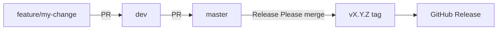

# Git & deployment workflow

## Branch model



| Branch | Role |
|--------|------|
| `feature/*` | Day-to-day development |
| `dev` | Integration / staging — features merge here first |
| `master` | Production-ready — only receives PRs from `dev` or Release Please |
| `v*` tags | Created on `master` by Release Please → triggers Goreleaser |

## Daily development

```bash
# 1. Branch from dev
git fetch origin
git checkout dev
git pull origin dev
git checkout -b feature/interactive-config

# 2. Work + commit (Conventional Commits)
git commit -m "feat(tui): add configure wizard"

# 3. Push and open PR -> dev
git push -u origin feature/interactive-config
gh pr create --base dev --title "feat(tui): add configure wizard"
```

CI runs on every PR to `dev` or `master` (3 OS matrix).

## Promote dev to master (release candidate)

When `dev` is stable:

```bash
gh pr create --base master --head dev --title "chore: promote dev to master"
```

After merge to `master`:

1. **Release Please** opens `chore(master): release X.Y.Z` PR
2. Merge that PR
3. Tag `vX.Y.Z` is created on `master`
4. **release.yml** publishes binaries (Goreleaser)

Releases **only** ship from `master` tags — never from `dev`.

## PR rules (enforced by CI)

| Target | Allowed sources |
|--------|-----------------|
| `dev` | Any feature branch |
| `master` | `dev` only (+ Release Please bot branches) |

Direct `feature/*` → `master` PRs are rejected by `pr-policy.yml`.

## Local testing on a feature branch

```bash
./bin/muxdev --version
go test ./...
./bin/muxdev --no-interactive --config testdata/muxdev.yaml
```

See README for full local dev commands.

## GitHub branch protection (recommended)

Configure in repo Settings → Branches:

### `dev`
- Require PR before merge
- Require status checks: `test (ubuntu-latest)`, `test (macos-latest)`, `test (windows-latest)`, `branch-flow`
- Require branches up to date

### `master`
- Same as `dev`
- Restrict who can push (maintainers only)
- Do not allow bypassing the above settings

## Hotfix (optional escape hatch)

For urgent production fixes:

```bash
git checkout master
git pull
git checkout -b hotfix/critical-fix
# fix, commit, PR directly to master — temporarily disable pr-policy or use maintainer override
```

Prefer routing hotfixes through `dev` when possible to keep branches aligned:

```bash
# hotfix -> dev -> master (two PRs)
```
