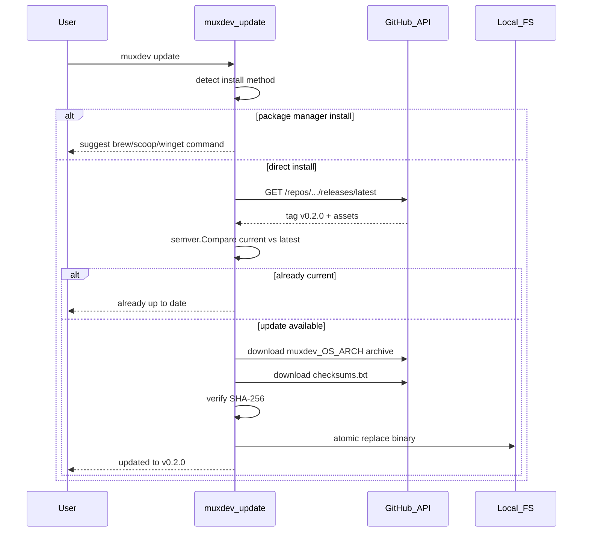
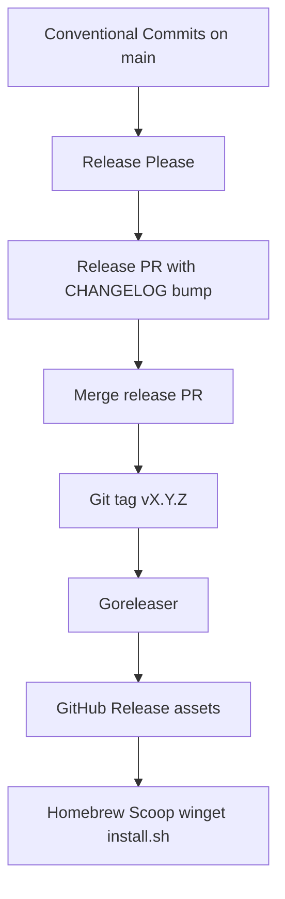
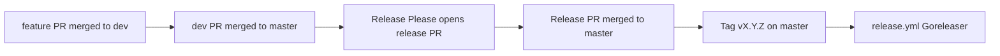

# Release, deployment & SemVer

This document defines how muxdev is versioned, shipped, and distributed across platforms.

## Goals

- **SemVer tracking** via [Release Please](https://github.com/googleapis/release-please) + Conventional Commits
- **Single source of truth** for version: git tag → binary ldflags → package manifests
- **Full distribution**: GitHub Releases, `install.sh`, Homebrew, Scoop, winget
- **Reproducible pipeline**: feature → `dev` → `master` → Release Please tag → Goreleaser
- **User-facing updates**: channel-aware check + apply (`muxdev update`) with package-manager delegation

## Current state

| Piece | Status |
|-------|--------|
| Goreleaser config | Done (`.goreleaser.yaml`, brews + scoops) |
| CI matrix (linux/macos/windows) | Done (`.github/workflows/ci.yml`) |
| Release workflow on tag | Done (`.github/workflows/release.yml`) |
| Release Please | Done (`.github/workflows/release-please.yml`) |
| `install.sh` | Done (checksum verify) |
| Version in binary | Done (`internal/version`, Goreleaser ldflags) |
| Built-in updater | Done (`muxdev update`, `muxdev version`) |
| Package manifest templates | Done (`packaging/`) |
| Git tags / GitHub Release | Pending first Release Please merge |
| External tap/bucket repos | Pending (`homebrew-tap`, `scoop-bucket`) |
| winget-pkgs PR | Pending (templates in `packaging/winget/`) |

## Update mechanism

Users install muxdev through different channels; the updater must **detect the install method** and choose the right path.

### Design principles

1. **Delegate when possible** — package managers already handle updates; don't fight them
2. **Self-update for direct installs** — `install.sh` / manual binary / `go install` users get `muxdev update`
3. **Verify before apply** — SHA-256 from `checksums.txt` (same trust model as `install.sh`)
4. **Non-blocking by default** — update check must not slow down `muxdev` startup; failures are silent unless `--check`
5. **SemVer comparison** — use `golang.org/x/mod/semver` (`v` prefix required)

### Install method detection

```mermaid
flowchart TD
  exe[Current executable path]
  detect{Detect install method}
  direct[direct / install.sh]
  brew[homebrew]
  scoop[scoop]
  winget[winget]
  goinst[go install]
  unknown[unknown]

  exe --> detect
  detect -->|"/opt/homebrew/Cellar" or "/usr/local/Cellar"| brew
  detect -->|"~/scoop/apps/muxdev"| scoop
  detect -->|"WindowsApps/winget"| winget
  detect -->|"GOPATH/bin or GOBIN"| goinst
  detect -->|"~/.local/bin or manual path"| direct
  detect -->|no match| unknown
```

| Method | Detection heuristic | Update strategy |
|--------|---------------------|-----------------|
| **direct** | `~/.local/bin`, `/usr/local/bin`, user-defined `INSTALL_DIR` | `muxdev update` self-replace |
| **install.sh** | same as direct (install.sh drops binary in `INSTALL_DIR`) | `muxdev update` or re-run `install.sh` |
| **homebrew** | path under `Cellar/muxdev/` or `brew --prefix muxdev` | print `brew upgrade muxdev` |
| **scoop** | path under `scoop/apps/muxdev/` | print `scoop update muxdev` |
| **winget** | path under `WindowsApps` or package metadata | print `winget upgrade yarkingulacti.muxdev` |
| **go install** | binary in `$GOBIN` or `$GOPATH/bin`, `version=dev` or module build | print `go install ...@vX.Y.Z` |
| **dev** | `version == "dev"` | skip update; print `go install` hint |
| **unknown** | fallback | offer self-update if writable, else print release URL |

Optional Goreleaser ldflag for certainty on packaged builds:

```yaml
ldflags:
  - -X .../internal/version.InstallMethod={{ .Env.INSTALL_METHOD }}
```

Set per publisher (`direct`, `brew`, `scoop`) when Goreleaser builds channel-specific artifacts. Default: `direct` for GitHub Release binaries.

### CLI surface

New cobra subcommand group:

```bash
muxdev update              # check + apply if newer stable exists
muxdev update --check      # check only, exit 0 if up to date, exit 2 if update available
muxdev update --yes        # skip confirmation prompt
muxdev update --version v0.2.0   # pin target (default: latest stable)
muxdev update --channel stable|prerelease   # default: stable
```

`muxdev version` (extend existing `--version`):

```bash
muxdev version             # 0.1.0 (commit abc1234, 2026-06-19)
muxdev version --short     # 0.1.0
muxdev version --json      # machine-readable for scripts
```

### Update flow (self-update path)



### GitHub API contract

Reuse release asset naming from Goreleaser:

```
GET https://api.github.com/repos/yarkingulacti/muxdev-cli/releases/latest
# or GET .../releases/tags/v0.2.0 when --version set
```

Asset selection:

```
muxdev_{version}_{goos}_{goarch}.tar.gz   # unix
muxdev_{version}_{goos}_{goarch}.zip      # windows
```

Checksum line format (Goreleaser default):

```
<sha256>  muxdev_0.2.0_linux_amd64.tar.gz
```

Use `Accept: application/vnd.github+json` and a custom `User-Agent` (`muxdev-updater/<version>`).

### Binary replacement (platform-specific)

| OS | Strategy |
|----|----------|
| **Linux/macOS** | Download to `{exe}.new` → chmod `0755` → `rename(2)` over current binary (atomic on same filesystem) |
| **Windows** | Cannot replace running `.exe`. Download to temp → spawn `{exe} _update-apply <temp> <target>` hidden child **or** rename running to `muxdev.exe.old` + copy new + prompt restart. Recommend **scoop/winget delegation** as primary Windows path; self-update as best-effort for direct installs |

Windows self-update MVP message when in-use:

```
Update downloaded to %TEMP%\muxdev.exe.
Close this terminal and run: muxdev update --apply-pending
```

Store pending path in `%LOCALAPPDATA%\muxdev\update-pending.json`.

### Optional startup notification

When running interactive TUI (not `--no-interactive`, TTY present):

- Background goroutine: `update.Check(ctx, update.CheckOpts{Channel: stable})` with **2s timeout**
- If newer version found: one-line banner in TUI header footer:
  `Update available: v0.2.0 — run: muxdev update`
- Respect opt-out: env `MUXDEV_NO_UPDATE_CHECK=1` or config file (below)

Never auto-apply on startup.

### User configuration

`~/.config/muxdev/config.yaml` (optional, XDG on Linux, `%APPDATA%\muxdev` on Windows):

```yaml
update:
  check_on_start: true        # default: true for interactive TUI
  channel: stable             # stable | prerelease
  interval: 24h               # skip network if last check within interval
```

Cache last check result:

```
~/.cache/muxdev/update.json    # { "checked_at", "latest", "current" }
```

### Shared install/update library

Extract download + verify into `internal/update/` (used by CLI and mirrored by `install.sh` logic):

```
internal/update/
  check.go      # GitHub release fetch, semver compare
  download.go   # asset URL resolve, HTTP download
  verify.go     # checksums.txt parse + SHA-256
  apply.go      # platform-specific binary replace
  detect.go     # install method detection
  detect_windows.go
  detect_unix.go
```

`scripts/install.sh` remains the zero-dependency bootstrap; keep behavior in sync with Go constants:

```go
const (
  RepoOwner = "yarkingulacti"
  RepoName  = "muxdev-cli"
)
```

### Package manager update UX

When detection returns `homebrew` / `scoop` / `winget`:

```bash
$ muxdev update --check
muxdev 0.1.0 (installed via Homebrew)
Update available: 0.2.0
Run: brew upgrade muxdev
```

Exit codes (script-friendly):

| Code | Meaning |
|------|---------|
| `0` | Up to date |
| `1` | Error |
| `2` | Update available |

### `go install` users

Detection: `version.InstallMethod == "go"` or heuristic on module path.

```bash
go install github.com/yarkingulacti/muxdev-cli/cmd/muxdev@v0.2.0
```

`muxdev update` prints exact command with resolved latest tag.

### Pre-release / channel policy

| Channel | GitHub source | Who |
|---------|---------------|-----|
| `stable` | Latest non-prerelease release | default for all users |
| `prerelease` | Latest release including alphas/betas/rc | opt-in `--channel prerelease` |

SemVer pre-release comparison: `semver.Compare("v0.2.0-beta.1", "v0.2.0")` → beta is older than stable.

### Security considerations

- HTTPS only; pin to `github.com` release URLs
- Mandatory checksum verify before apply (fail closed)
- No arbitrary URL override in MVP (no `--url` flag)
- Optional future: minisign/cosign signature verification

### Testing plan

| Test | Type |
|------|------|
| semver compare edge cases | unit |
| checksums.txt parsing | unit |
| install method detection (fake paths) | unit |
| mock GitHub API server | integration |
| self-update apply on linux (temp dir) | integration |
| `--check` exit codes | e2e |
| brew/scoop delegation messages | unit |

### Update implementation checklist

- [ ] `internal/version/` with `Version`, `Commit`, `Date`, `InstallMethod`
- [ ] `internal/update/` package (check, download, verify, apply, detect)
- [ ] `muxdev update` cobra subcommand
- [ ] `muxdev version` subcommand with `--short` / `--json`
- [ ] TUI optional startup banner (respects `MUXDEV_NO_UPDATE_CHECK`)
- [ ] `~/.config/muxdev/config.yaml` parser (optional)
- [ ] Windows pending-update apply path
- [ ] Document update UX in `README.md` per install channel
- [ ] `install.sh --check` mode (optional parity with `muxdev update --check`)

## SemVer policy

Follow [Semantic Versioning 2.0.0](https://semver.org/).

### Pre-1.0 rules (current phase)

While `major == 0`:

- **MINOR** bump: new user-facing features (TUI panels, new CLI flags, config fields)
- **PATCH** bump: bug fixes, internal refactors, docs-only (if Release Please groups them)
- Breaking changes may ship in MINOR with clear CHANGELOG notes

### Post-1.0 rules

- **MAJOR**: breaking `muxdev.yaml` schema or CLI contract changes
- **MINOR**: backward-compatible features
- **PATCH**: backward-compatible fixes

### Pre-release channels

| Tag pattern | Channel | Goreleaser |
|-------------|---------|------------|
| `v1.2.3` | Stable | `prerelease: false` |
| `v1.2.3-rc.1` | Release candidate | `prerelease: auto` |
| `v1.2.3-beta.1` | Beta | `prerelease: auto` |
| `v1.2.3-alpha.1` | Alpha | `prerelease: auto` |

Release Please config should allow pre-release branches later; start with `main` → stable only.

### Conventional Commits → version bump

Release Please maps commit types:

| Commit type | SemVer impact |
|-------------|---------------|
| `feat` | MINOR (or MAJOR if `feat!:` / `BREAKING CHANGE:`) |
| `fix` | PATCH |
| `perf` | PATCH |
| `refactor`, `chore`, `docs`, `ci`, `test`, `build` | no release by default |

Aligns with existing repo commit rules (`type(scope): summary`).

## Version source of truth



### Binary metadata

Move version constants to `internal/version/`:

```go
// Set at link time by Goreleaser
var (
    Version = "dev"
    Commit  = "none"
    Date    = "unknown"
)
```

Goreleaser `ldflags`:

```yaml
ldflags:
  - -s -w
  - -X github.com/yarkingulacti/muxdev-cli/internal/version.Version={{.Version}}
  - -X github.com/yarkingulacti/muxdev-cli/internal/version.Commit={{.Commit}}
  - -X github.com/yarkingulacti/muxdev-cli/internal/version.Date={{.Date}}
```

`muxdev --version` output:

```
muxdev 0.1.0 (commit abc1234, 2026-06-19)
```

Dev builds (`go run`, `go build` without ldflags) show `dev`.

## Release policy

Git flow: see [docs/git-workflow.md](git-workflow.md) for branch rules.

Releases are **automatic only** through this path:



**Allowed triggers**

| Event | Workflow | Result |
|-------|----------|--------|
| Push to `master` | `release-please.yml` | Opens/updates release PR |
| Merge release PR to `master` | Release Please | Creates `v*` tag on `master` |
| Push `v*` tag (from master) | `release-please.yml` publish job | Goreleaser binaries + Nexus (after Release Please) |
| Manual republish | `release.yml` (`workflow_dispatch`) | Emergency Goreleaser + Nexus for an existing tag |
| GitHub Release published | `packages.yml` | Packaging validation |

**Not allowed**

- Manual `workflow_dispatch` on release workflows (removed)
- Manual `git tag && git push` (tag must come from Release Please merge)
- Release from non-`master` branches

## Release pipeline

### Workflows

| Workflow | Trigger | Purpose |
|----------|---------|---------|
| `ci.yml` | push/PR to `dev` or `master` | test + build matrix |
| `pr-policy.yml` | PR to `dev` or `master` | enforce feature→dev→master |
| `release-please.yml` | push to `master` | Release Please PR; on merge → tag + Goreleaser + Nexus |
| `release.yml` | manual dispatch | republish an existing tag (recovery) |
| `packages.yml` | GitHub Release published | validate packaging templates |

### Step-by-step (steady state)

1. Developer merges feature PRs to `dev` with Conventional Commits
2. When ready, open PR `dev` → `master` and merge
3. **Release Please** opens/updates `chore(master): release X.Y.Z` PR on `master` containing:
   - `CHANGELOG.md` section
   - version bump in release manifest
4. Maintainer reviews changelog, merges Release PR to `master`
5. Release Please creates git tag `vX.Y.Z` on `master` and opens the GitHub Release with notes from `CHANGELOG.md`
6. **Release Please workflow** runs Goreleaser + Nexus upload on the same tag (no raw git-log release notes)
7. **packages.yml** runs after release is published
8. Smoke test:
   - `install.sh` against new release
   - `brew install` / `scoop install` / `winget install` on each OS

### First release bootstrap

Release Please needs an initial version anchor:

1. Add `release-please-config.json` with `"release-type": "go"`, `"initial-version": "0.1.0"`
2. Add empty `CHANGELOG.md` with `## [0.1.0]` stub or let Release Please generate
3. Merge pending work to `main`
4. Let Release Please create first release PR → merge → `v0.1.0` tag

No manual `git tag` for routine releases after bootstrap.

## Distribution channels

### 1. GitHub Releases (primary artifact store)

**Assets per release:**

```
muxdev_X.Y.Z_linux_amd64.tar.gz
muxdev_X.Y.Z_linux_arm64.tar.gz
muxdev_X.Y.Z_darwin_amd64.tar.gz
muxdev_X.Y.Z_darwin_arm64.tar.gz
muxdev_X.Y.Z_windows_amd64.zip
muxdev_X.Y.Z_windows_arm64.zip
checksums.txt
```

Goreleaser `name_template` already matches `install.sh` expectations.

### 2. `scripts/install.sh` (curl pipe)

**Planned hardening:**

- Verify `checksums.txt` SHA-256 after download
- Replace `grep` JSON parsing with `curl -H "Accept: application/vnd.github+json"` + `jq` (or pure bash fallback)
- Support `VERSION=v0.1.0` pin and `VERSION=latest`
- Windows Git Bash / MSYS path for `INSTALL_DIR`

### 3. Homebrew (macOS + Linuxbrew)

**Structure:** separate tap repo recommended

```
yarkingulacti/homebrew-tap/Formula/muxdev.rb
```

Formula pattern:

```ruby
class Muxdev < Formula
  desc "Multiplexed dev stack runner"
  homepage "https://github.com/yarkingulacti/muxdev-cli"
  url "https://github.com/yarkingulacti/muxdev-cli/archive/refs/tags/vX.Y.Z.tar.gz"
  # or direct release binary URL for bottle-less install
  license "MIT"
  head "https://github.com/yarkingulacti/muxdev-cli.git", branch: "main"

  depends_on "go" => :build  # only if building from source
  # prefer prebuilt binary bottles via Goreleaser brew hook
end
```

**Automation options:**

- Goreleaser `brews` section publishing to tap repo (simplest)
- or `packages.yml` commit to tap on release

Install:

```bash
brew tap yarkingulacti/tap
brew install muxdev
```

### 4. Scoop (Windows)

**Structure:** bucket repo

```
yarkingulacti/scoop-bucket/bucket/muxdev.json
```

```json
{
  "version": "0.1.0",
  "description": "Multiplexed dev stack runner",
  "homepage": "https://github.com/yarkingulacti/muxdev-cli",
  "license": "MIT",
  "url": "https://github.com/yarkingulacti/muxdev-cli/releases/download/v0.1.0/muxdev_0.1.0_windows_amd64.zip",
  "hash": "sha256:...",
  "bin": "muxdev.exe"
}
```

Update `hash` + `url` on each release via `packages.yml` or Goreleaser `scoops` publisher.

Install:

```powershell
scoop bucket add yarkingulacti https://github.com/yarkingulacti/scoop-bucket
scoop install muxdev
```

### 5. winget (Windows)

Publish to [winget-pkgs](https://github.com/microsoft/winget-pkgs) via manifest PR.

**Manifest trio** (`yarkingulacti.muxdev`):

- `yarkingulacti.muxdev.installer.yaml`
- `yarkingulacti.muxdev.locale.en-US.yaml`
- `yarkingulacti.muxdev.yaml`

Installer type: `zip` portable binary (no MSI needed initially).

`packages.yml` should:

1. Generate manifest from release metadata
2. Open PR to `microsoft/winget-pkgs` (or document manual step until token/approval flow exists)

Install:

```powershell
winget install yarkingulacti.muxdev
```

## CI gates & safety

### Required before any release tag

- CI matrix green on the tagged commit
- `go test ./...` passes on all three OSes
- Goreleaser `release --clean` dry-run in CI on Release PR (optional job)

### Release workflow hardening (planned changes to `release.yml`)

```yaml
# Pseudocode additions
- name: Verify tag is on main
- name: Wait for CI on tag commit (gh run watch)
- name: Goreleaser dry-run on PRs (snapshot)
```

### Tag protection (GitHub repo settings)

- Restrict tag creation to GitHub Actions / maintainers
- Prevent accidental non-semver tags (`v*` regex: `^v(0|[1-9]\d*)\.(0|[1-9]\d*)\.(0|[1-9]\d*)(-(alpha|beta|rc)(\.\d+)?)?$`)

## Files to add (implementation checklist)

### SemVer & changelog

- [ ] `release-please-config.json`
- [ ] `.github/workflows/release-please.yml`
- [ ] `CHANGELOG.md` (Release Please managed)
- [ ] `internal/version/version.go`
- [ ] Update `cmd/muxdev/main.go` to use `internal/version`
- [ ] Update `.goreleaser.yaml` ldflags paths

### Release hardening

- [ ] `release.yml`: CI gate / semver tag validation
- [ ] `scripts/install.sh`: checksum verification
- [ ] Goreleaser: `brews`, `scoops` sections OR separate `packages.yml`

### Package manifests

- [ ] `yarkingulacti/homebrew-tap` repo + `Formula/muxdev.rb`
- [ ] `yarkingulacti/scoop-bucket` repo + `bucket/muxdev.json`
- [ ] `winget-manifests/yarkingulacti/muxdev/` in this repo (source) → PR to winget-pkgs
- [ ] `.github/workflows/packages.yml`

### Documentation

- [ ] `README.md` install section for all channels
- [ ] `docs/release.md` (this file) — maintainer runbook

### Update mechanism

- [ ] `internal/update/` (check, download, verify, apply, detect)
- [ ] `muxdev update` + `muxdev version` subcommands
- [ ] TUI startup update banner (opt-out via env/config)
- [ ] Windows pending-update apply flow
- [ ] Update section in `README.md`

## Maintainer runbook (routine release)

No manual version edits. After features land on `dev` and are promoted to `master`:

1. Merge `dev` → `master` when integration is stable
2. Wait for Release Please PR (`chore(master): release X.Y.Z`)
2. Review `CHANGELOG.md` diff in that PR
3. Merge PR to `master`
4. Confirm tag `vX.Y.Z` created on `master`
5. Watch `release.yml` then `packages.yml` in Actions
6. Verify:
   - GitHub Release assets + checksums
   - `curl install.sh | bash` smoke test
   - `brew upgrade muxdev` / `scoop update muxdev` / `winget upgrade`
7. Announce if needed (GitHub Release is canonical)

### Hotfix flow

1. Fix on `master` as `fix(scope): ...`
2. Release Please opens PATCH bump PR
3. Merge to `master` — same pipeline, no manual steps

## Timeline (suggested implementation order)

| Phase | Scope | Effort |
|-------|-------|--------|
| **R1** | `internal/version`, Release Please, CHANGELOG, ldflags | 0.5 day |
| **R2** | `release.yml` hardening, `install.sh` checksums | 0.5 day |
| **R3** | Goreleaser `brews` + tap repo | 0.5 day |
| **R4** | Scoop bucket + automation | 0.5 day |
| **R5** | winget manifests + PR automation | 1 day |
| **U1** | `internal/update` check + verify + `muxdev update --check` | 0.5 day |
| **U2** | Self-update apply (unix) + package-manager delegation | 0.5 day |
| **U3** | TUI startup banner, config cache, Windows pending apply | 0.5 day |
| **R6** | First public release `v0.1.0` end-to-end smoke | 0.5 day |

**Total:** ~4–5 days to full-channel shipping + updater with automated SemVer.

## Open decisions (deferred)

- ~~**Repository visibility**~~ — **done:** repo is public; `install.sh` and `muxdev update` use GitHub Releases without auth
- **TAP_GITHUB_TOKEN** — add repo secret with `repo` scope so Goreleaser can push Homebrew/Scoop manifests on release
- **SBOM / provenance** — GitHub artifact attestations (optional)
- **npm wrapper** — not planned; Go binary is the distribution unit
- **Linux distro packages** (AUR, apt) — post-1.0 if demand exists

## Success criteria for v0.1.0 launch

- [ ] `muxdev --version` matches tag on all 6 binaries
- [ ] Release Please created tag without manual intervention
- [ ] `install.sh` installs and checksum-verifies latest
- [ ] `brew install muxdev` works on macOS
- [ ] `scoop install muxdev` works on Windows
- [ ] `winget install yarkingulacti.muxdev` works on Windows
- [ ] CHANGELOG documents TUI, runner, and platform support

## Success criteria for updater (v0.2.0 or bundled with v0.1.0 if time)

- [ ] `muxdev update --check` returns exit 2 when GitHub has newer stable
- [ ] Direct install (`install.sh`) self-updates on Linux/macOS
- [ ] Homebrew/Scoop/winget installs print correct delegation command
- [ ] Checksum mismatch aborts update without touching binary
- [ ] `MUXDEV_NO_UPDATE_CHECK=1` disables TUI startup banner
